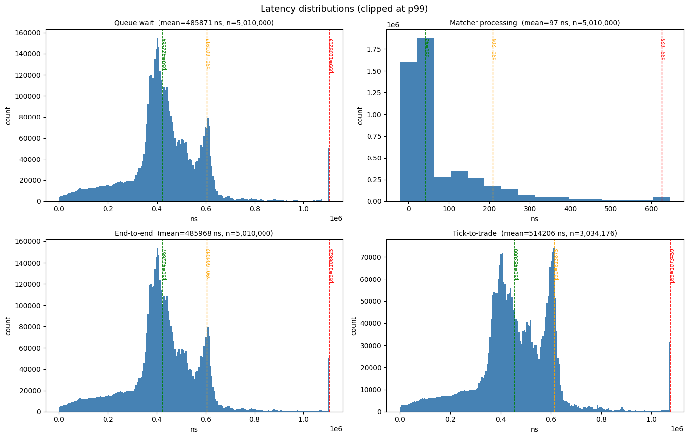

# Limit Order Book

A high-performance **limit order book (LOB)** simulator written in modern C++17. Orders are ingested from disk, matched with **price–time priority**, and trades can be streamed to a dedicated output thread—all on a **three-stage concurrent pipeline** designed for throughput on large workloads.

## Project Layout

```
cpp-lob/
├── main.cpp              # thread orchestration, timing
├── market.hpp            # LOB state, queues, API
├── order_processor.cpp   # CLI, mmap ingest, order pool
├── matching_engine.cpp   # BST, matching, execution
├── output_engine.cpp     # trade consumer (-o)
├── order.hpp / limit.hpp / trade.hpp / queue.hpp
├── random.cpp            # realistic order-flow generator (-r): 10k seed + 5M trading
├── test-files/
│   ├── test1.txt         # functional scenario (~800 lines)
│   ├── test2.txt         # 1M orders
│   └── test3.txt     # 5M+ orders generated by -r
└── Makefile
```

## Architecture

```cpp
Order
  uint64_t entryTime;
  uint64_t eventTime;
  uint32_t idNumber;
  uint32_t shares;
  uint32_t limitPrice;
  bool buyOrder;
  Order *nextOrder;
  Order *prevOrder;
  Limit *parentLimit;
  
Limit // represents a single price level
  uint32_t limitPrice;
  uint32_t size; // number of orders at this level
  uint32_t totalVolume; // total number of shares
  Limit *parent;
  Limit *leftChild;
  Limit *rightChild;
  Order *headOrder;
  Order *tailOrder;
  
Trade
  uint32_t id;
  uint32_t price;
  uint32_t shares;
  uint64_t executionTime;
  uint32_t buyerID;
  uint32_t sellerID;
```

The `Market` class holds two buy and sell binary trees of `Limit` objects sorted by `limitPrice`. Each `Limit` object contains a doubly linked list of `Order` objects. This structure allows for the inside of the book to correspond with the end of the buy limit tree and the start of the sell limit tree. `lowestSell` and `highestBuy` pointers are stored and updated to allow quick retrieval during order matching.

Orders are stored in a map keyed by `idNumber`, and limits are stored in a map keyed by `limitPrice`. 

With this structure, the following key operations can be efficiently implemented:

- Add Order: O(log M) for the first order at a price level, O(1) for subsequent orders (M = number of price levels)
- Cancel Order: O(1) // not implemented yet
- getVolumeAtLimit - O(1)
- getBestBid - O(1)
- getBestAsk - O(1)

Assumptions:

- Order shares are greater than 0
- Limit prices are greater than 0

## Design Decisions

Throughput comes from overlapping work across three threads (read, match, optional trade logging) connected by custom, bounded **single-producer, single-consumer** ring buffers with cache-line–aligned indices and acquire/release atomics.

Since the current implementation reads orders from an input file, processing is sped up through input file mapping with `mmap`, allowing orders to be parsed with `std::from_chars` directly from memory. This eliminates the need for costly iostreams on the hotpath.

To increase throughput, `Order` objects are allocated from a 64 MiB **PMR monotonic buffer** via placement `new`, avoiding per-order heap traffic.

## Usage

### Requirements

- C++17 compiler (tested with **g++** on macOS/Linux)
- `make`

### Build

```bash
make          # release binary: ./cpp-lob
make profile  # ./cpp-lob-profile (symbols for profiling)
make clean
```

### Run

An input file is **required** (`-f`). Orders are read from the file; matching runs concurrently; wall-clock time is printed when all threads finish.

```bash
# Small sample
./cpp-lob -f sample_input.txt

# Bundled scenarios
./cpp-lob -f test-files/test1.txt    # ~800 orders, mixed book dynamics
./cpp-lob -f test-files/test2.txt    # 1M orders
./cpp-lob -f test-files/test3.txt    # 5M+ realistic flow (generate with -r)

# Stream trade fills to stdout
./cpp-lob -f test-files/test1.txt -o
```

### CLI


| Flag                  | Description                                       |
| --------------------- | ------------------------------------------------- |
| `-h`, `--help`        | Usage summary                                     |
| `-f <path>`, `--file` | **Required.** Path to order input file            |
| `-r`, `--random`      | Write realistic order flow (10k seed + 5M trading) to the file given by `-f` |
| `-o`, `--output`      | Enable trade logging on the output thread         |


### Input Format

One order per line (lines starting with `#` are comments):

```
<ORDER_TYPE> <LIMIT_PRICE> <QUANTITY>
```

- `ORDER_TYPE`: `B` (buy) or `S` (sell)
- `LIMIT_PRICE`, `QUANTITY`: unsigned integers

### Random Generator

Running with `-r` writes a two-phase order stream seeded by a fixed PRNG (`std::mt19937`, seed `42`), so the output is deterministic for benchmarking.

1. **Seed book (10,000 orders).** Resting liquidity around `MID = 10000`. Buys populate prices `MID - 1 .. MID - 50`, sells `MID + 1 .. MID + 50`, leaving a one-tick spread at the mid.
2. **Trading flow (5,000,000 orders).** A simulated reference price random-walks around `MID` (clamped to `MID ± 500`). Each order is ~50/50 buy/sell with ~30% aggressive (crossing the touch) and ~70% passive (resting near the touch), so `bestBid` / `bestAsk` and trade prices drift naturally as the file replays.

## Testing and Performance

For testing, I used the random data generator specificed above to create 5,010,000 requests. The initial 10,000 orders were used to seed the order book to replicate a realistic exchange. 

In testing, I recorded four different metrics:
- Queue Wait: order entry → matcher dequeue (time spent in SPSC queue)
- Matcher Processing: matcher dequeue → order-book update complete
- End-to-End: order entry → order-book update complete (= queue wait + matcher processing)
- Tick-to-Trade: taker entry time → trade execution (per trade)

These measurements were all recorded on my MacBook Air with an M3 chip. Times were stamped using macOS `steady_clock` which ticks at 24 MHz, or around 41.67ns/tick. Data such as queue-wait shows p50 values of 41ns or exactly one tick. These values should be primarily ignored as the per-order latencies are in actuality at or below the clock's granularity. More important observations can be made by looking at the tail percentiles instead.

### Latency Distributions



As seen in the distributions, queue wait is the dominating factor in terms of total end-to-end latency. Matcher processing tops out at around 630ns (p99) with a mean of 97ns. Meanwhile, queue wait runs out to 1.1 ms in the clipped view with a mean of ~486 µs. The matching engine itself is essentially free, while almost all latency an order experiences is spent waiting in the SPSC queue, before it ever gets to the matcher. 

From this conclusion, it follows that the end-to-end distribution almost perfectly matches queue wait. Since end-to-end is measured as `queue_wait + matcher_processing` and matcher processing is ~97ns, queue wait time dominates the recorded values. 

Tick-to-trade follows a similar story as end-to-end. It includes the taker time stuck in the queue, which gives it a similar bimodial shape to queue-wait. The mean value of 514µs, a bit higher than end-to-end's mean of ~486µs, can be explained by the fact that these taker orders which cross the spread come at busier and more backlogged periods.

From this data we can conclude that the real bottleneck is consumer throughput vs input rate. 

## References

[How to Build a Fast Limit Order Book - wkselph](https://web.archive.org/web/20110219163448/http://howtohft.wordpress.com/2011/02/15/how-to-build-a-fast-limit-order-book/)