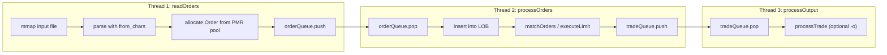

# Limit Order Book

A high-performance **limit order book (LOB)** simulator written in modern C++17. Orders are ingested from disk, matched with **price–time priority**, and trades can be streamed to a dedicated output thread—all on a **three-stage concurrent pipeline** designed for throughput on large workloads.

---

## Quick Start

### Requirements

- C++17 compiler (tested with **g++** on macOS/Linux)
- `make`

### Build

```bash
make          # release binary: ./cpp-lob
make profile  # ./cpp-lob-profile (symbols for profiling)
make clean
```

### Run

An input file is **required** (`-f`). Orders are read from the file; matching runs concurrently; wall-clock time is printed when all threads finish.

```bash
# Small sample
./cpp-lob -f sample_input.txt

# Bundled scenarios
./cpp-lob -f test-files/test1.txt    # ~800 orders, mixed book dynamics
./cpp-lob -f test-files/test2.txt    # 1M orders
./cpp-lob -f test-files/test3.txt  # 10M orders (stress test)

# Stream trade fills to stdout
./cpp-lob -f test-files/test1.txt -o
```

### CLI


| Flag                  | Description                                       |
| --------------------- | ------------------------------------------------- |
| `-h`, `--help`        | Usage summary                                     |
| `-f <path>`, `--file` | **Required.** Path to order input file            |
| `-r`, `--random`      | Write 10M random orders to the file given by `-f` |
| `-o`, `--output`      | Enable trade logging on the output thread         |


### Input format

One order per line (lines starting with `#` are comments):

```
<ORDER_TYPE> <LIMIT_PRICE> <QUANTITY>
```

- `ORDER_TYPE`: `B` (buy) or `S` (sell)
- `LIMIT_PRICE`, `QUANTITY`: unsigned integers

---

## Project layout

```
cpp-lob/
├── main.cpp              # thread orchestration, timing
├── market.hpp            # LOB state, queues, API
├── order_processor.cpp   # CLI, mmap ingest, order pool
├── matching_engine.cpp   # BST, matching, execution
├── output_engine.cpp     # trade consumer (-o)
├── order.hpp / limit.hpp / trade.hpp / queue.hpp
├── random.cpp            # 10M-order generator (-r)
├── test-files/
│   ├── test1.txt         # functional scenario (~800 lines)
│   ├── test2.txt         # 1M orders
│   └── test3.txt     # 10M orders (~84 MB)
└── Makefile
```

---

## Architecture

```cpp
Order
  uint64_t entryTime;
  uint64_t eventTime;
  uint32_t idNumber;
  uint32_t shares;
  uint32_t limitPrice;
  bool buyOrder;
  Order *nextOrder;
  Order *prevOrder;
  Limit *parentLimit;
  
Limit // represents a single price level
  uint32_t limitPrice;
  uint32_t size; // number of orders at this level
  uint32_t totalVolume; // total number of shares
  Limit *parent;
  Limit *leftChild;
  Limit *rightChild;
  Order *headOrder;
  Order *tailOrder;
  
Trade
  uint32_t id;
  uint32_t price;
  uint32_t shares;
  uint64_t executionTime;
  uint32_t buyerID;
  uint32_t sellerID;
```

The `Market` class holds two buy and sell binary trees of `Limit` objects sorted by `limitPrice`. Each `Limit` object contains a doubly linked list of `Order` objects. This structure allows for the inside of the book to correspond with the end of the buy limit tree and the start of the sell limit tree. `lowestSell` and `highestBuy` pointers are stored and updated to allow quick retrieval during order matching.

Orders are stored in a map keyed by `idNumber`, and limits are stored in a map keyed by `limitPrice`. 

With this structure, the following key operations can be efficiently implemented:

- Add Order: O(log M) for the first order at a price level, O(1) for subsequent orders (M = number of price levels)
- Cancel Order: O(1) // not implemented yet
- getVolumeAtLimit - O(1)
- getBestBid - O(1)
- getBestAsk - O(1)

Assumptions:

- Order shares are greater than 0
- Limit prices are greater than 0

---

## Design Decisions




Throughput comes from overlapping work across three threads (read, match, optional trade logging) connected by custom, bounded **single-producer, single-consumer** ring buffers with cache-line–aligned indices and acquire/release atomics.

Since the current implementation reads orders from an input file, processing is sped up through input file mapping with `mmap`, allowing orders to be parsed with `std::from_chars` directly from memory. This eliminates the need for costly iostreams on the hotpath.

To increase throughput, `Order` objects are allocated from a 64 MiB **PMR monotonic buffer** via placement `new`, avoiding per-order heap traffic.

---

## References

[How to Build a Fast Limit Order Book - wkselph](https://web.archive.org/web/20110219163448/http://howtohft.wordpress.com/2011/02/15/how-to-build-a-fast-limit-order-book/)